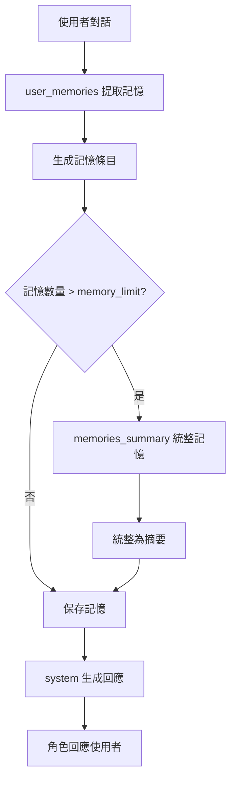
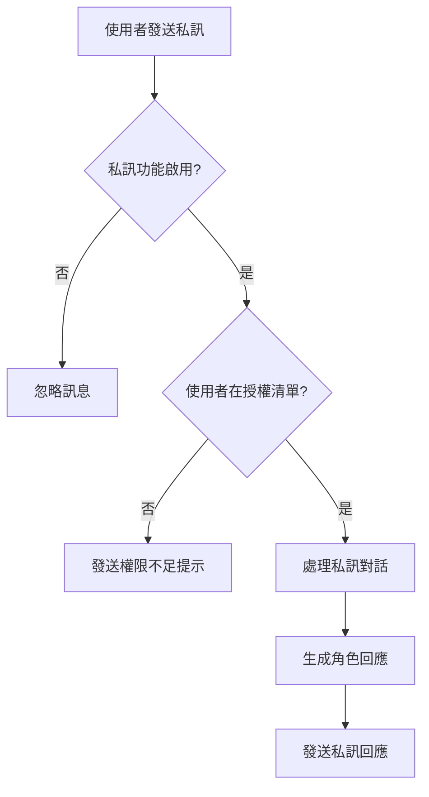

# Kikyo Discord BOT

多角色 Discord Bot 系統，支援獨立的虛擬人物角色，每個角色都有專屬的 AI 記憶系統。具備群組對話追蹤功能，讓 BOT 能夠感知多使用者對話環境並自然地與所有參與者互動。

## 🚀 快速開始

完整安裝文件：https://hackmd.io/@kikyoicecream/H1lydGdree

## 🎯 系統特色

- 🎭 **多角色支援**：同時 Host 多個 BOT，模組化新增角色
- 🧠 **智慧記憶系統**：基於 AI 的記憶提取、統整與管理
- 📝 **Prompt 模板系統**：模組化的 AI 提示詞管理，支援動態配置
- 👥 **群組對話追蹤**：追蹤活躍使用者，支援多使用者群組對話
- 💬 **私訊功能**：支援與授權使用者的私訊對話，具備權限管理
- ✨ **表情符號回應**：依照使用者對話內容，觸發表情符號回應
- 🔧 **統一雲端配置**：所有設定、參數、提示詞都儲存在 Firestore
- 🚀 **自動重啟**：Bot 異常時自動重啟功能
- 🔒 **安全過濾**：全域 Gemini AI 安全過濾器保護
- 🎯 **斜線指令**：keyword、memory、restart、intro 四種斜線指令
- ⚡ **統一架構**：Firebase 統一管理器，簡化代碼維護

## 📁 專案結構

```
Kikyo Discord BOT/
├── main.py                         # 主程式 - 多 Bot 啟動器
├── character_bot.py                # 角色 Bot 核心邏輯
├── character_registry_custom.py    # 角色註冊與設定管理
├── emoji_responses.py              # 表情符號回應系統
├── memory.py                       # AI 記憶管理與回應生成
├── group_conversation_tracker.py   # 群組對話追蹤
├── firebase_utils.py               # Firebase 統一管理器 🆕
├── requirements.txt                # Python 依賴套件
├── README.md                       # 專案說明文件
└── .env                            # 環境變數配置
```

## 🗄️ Firestore 資料庫結構

```
your-project/
├── prompt/                        # 🆕 AI 提示詞模板系統
│   ├── user_memories/             # 記憶提取提示詞
│   │   ├── content: "提示詞內容"
│   │   └── model: "gemini-2.0-flash"
│   ├── memories_summary/          # 記憶統整提示詞
│   │   ├── content: "提示詞內容"
│   │   ├── model: "gemini-2.0-flash"
│   │   └── memory_limit: 15       # 🆕 記憶統整門檻
│   └── system/                    # 系統角色提示詞
│       ├── content: "提示詞內容"
│       └── model: "gemini-2.5-pro"
├── {character_id}/                # 角色設定
│   ├── profile/                   # 角色設定檔
│   ├── users/                     # 使用者記憶（單一文件）
│   │   └── {user_id}: []          # 使用者 ID 對應記憶陣列
│   ├── emoji_system/              # 表情符號管理器
│   │   ├── general_emojis: []
│   │   ├── trigger_emojis: {}
│   │   ├── trigger_keywords: {}
│   │   ├── general_probability: 0.3
│   │   └── server_probability: 0.2
│   └── system/                    # 系統配置
│       ├── name: "角色名稱"
│       ├── token_env: "{CHARACTER_ID}_TOKEN"
│       ├── proactive_keywords: []
│       ├── enabled: true
│       ├── allowed_guilds: []
│       ├── allowed_channels: []
│       ├── enable_dm: false       # 🆕 私訊功能開關
│       ├── allowed_dm_users: []   # 🆕 允許私訊的使用者 ID 列表
│       ├── intro: "角色簡介文字"
│       └── gemini_config: {       # 🆕 統一 Gemini 配置
│           ├── model: "gemini-2.5-pro"
│           ├── temperature: 1.0
│           ├── top_k: 40
│           ├── top_p: 0.9
│           ├── max_output_tokens: 2048
│           └── enabled: true
│       }
```

## 🧠 AI 記憶與提示詞系統

### 📝 Prompt 模板系統

本系統採用模組化的 AI 提示詞管理，所有提示詞都儲存在 Firestore 的 `prompt` 集合中：

#### **1. `user_memories` - 記憶提取提示詞**
- **功能**：從使用者對話中提取重要資訊並生成結構化記憶
- **使用時機**：每當使用者與角色對話後自動觸發
- **可用變數**：`{character_name}`, `{user_name}`
- **輸出**：簡潔的記憶條目（每條 < 40 字）

#### **2. `memories_summary` - 記憶統整提示詞**
- **功能**：當記憶條目過多時，將多條記憶整合成精簡摘要
- **使用時機**：當使用者記憶數量超過 `memory_limit` 門檻時自動觸發
- **可用變數**：`{user_name}`
- **配置**：`memory_limit` - 記憶統整門檻（預設 15 條）
- **輸出**：統整後的記憶摘要（< 300 字）

#### **3. `system` - 系統角色提示詞**
- **功能**：定義角色的行為模式、說話風格和回應邏輯
- **使用時機**：每次生成角色回應時都會使用
- **可用變數**：`{character_name}`
- **動態組合**：角色設定 + 群組情況 + 使用者記憶 + 當前對話

### 🔄 記憶系統工作流程



### 🎛️ 動態配置特性

- **即時調整**：修改 Firestore 中的 `memory_limit` 無需重啟 BOT
- **角色專屬**：每個角色可使用不同的 Gemini 模型和參數
- **快取機制**：提示詞和配置具備快取功能，提升效能
- **錯誤處理**：完整的變數檢查和錯誤提示

## 👥 群組對話追蹤功能

### 功能概述
- **活躍使用者追蹤**：記錄哪些使用者正在與 BOT 對話
- **群組對話上下文**：了解整個對話的脈絡
- **主動提及其他使用者**：BOT 可以自然地提及其他活躍使用者
- **AI 對話摘要**：生成群組對話的摘要
- **BOT 回應追蹤**：記錄 BOT 自己的發言，確保對話連續性

## 🎭 斜線指令系統

### 可用指令

每個角色都有以下斜線指令：

#### `/{character_prefix}_restart`
- **功能**：重新啟動 Bot
- **範例**：`/shen_ze_restart`、`/gu_beichen_restart`

#### `/{character_prefix}_keywords`
- **功能**：顯示角色的主動關鍵字
- **範例**：`/shen_ze_keywords`、`/gu_beichen_keywords`
- **顯示內容**：角色名稱和對應的關鍵字列表

#### `/{character_prefix}_memories`
- **功能**：顯示角色與使用者的記憶內容
- **範例**：`/shen_ze_memories`、`/gu_beichen_memories`

#### `/{character_prefix}_intro`
- **功能**：顯示角色的簡介資訊
- **範例**：`/shen_ze_intro`、`/gu_beichen_intro`
- **顯示內容**：從 Firestore `/{character_id}/system/intro` 讀取的角色簡介

## 💬 私訊功能

### 功能概述
- **私訊對話**：支援與授權使用者的私訊對話
- **權限管理**：可設定允許私訊的使用者清單
- **功能開關**：每個角色可獨立啟用/停用私訊功能
- **安全控制**：未授權使用者嘗試私訊時會收到提示訊息

### 工作流程


### 安全特性
- **預設停用**：新角色預設不啟用私訊功能
- **白名單機制**：只有明確授權的使用者才能私訊
- **錯誤處理**：無法發送提示訊息時會靜默忽略
- **權限檢查**：每次私訊都會驗證使用者權限

## ⚙️ 配置管理

### 環境變數設定
在 `.env` 檔案中設定以下環境變數：

```bash
# Discord Bot Token 設定
SHEN_ZE_TOKEN=你的Discord_Bot_Token
GU_BEICHEN_TOKEN=你的Discord_Bot_Token
FAN_CHENGXI_TOKEN=你的Discord_Bot_Token
CHEN_ZHIWEN_TOKEN=你的Discord_Bot_Token

# Google Gemini API 設定
GOOGLE_API_KEY=你的Google_API_Key

# Firebase 設定（重要：必須是完整的一行 JSON）
FIREBASE_CREDENTIALS_JSON={"type":"service_account","project_id":"你的專案ID",...完整的Firebase憑證JSON...}
```

### 🚨 重要設定提醒

1. **Firebase 憑證**：`FIREBASE_CREDENTIALS_JSON` 必須是完整的一行 JSON 字串，不能有換行
2. **Discord Token**：環境變數名稱必須與 Firestore 中的 `token_env` 欄位對應
3. **排除集合**：系統會自動排除 `template`、`prompt` 之非角色集合

## 🔧 開發說明

### 程式架構特色
- **🆕 統一管理器**：`firebase_utils.py` 提供統一的 Firestore 連接和快取管理
- **模組化設計**：核心功能分離，易於維護和擴展
- **雲端配置**：所有設定都儲存在 Firestore，支援即時調整
- **完整錯誤處理**：詳細的異常處理和調試資訊
- **效能最佳化**：快取機制減少 Firestore 讀取次數
- **日誌記錄**：清晰的運行狀態和錯誤訊息

## 📋 環境需求

- **Python 3.9+**
- **Discord.py >= 2.3.0**
- **Firebase Admin SDK >= 6.0.0**
- **Google Generative AI == 0.8.3**
- **python-dotenv >= 1.0.0**
- **其他相依套件**請參考 `requirements.txt`

## 授權
此專案僅供個人使用和學習目的。